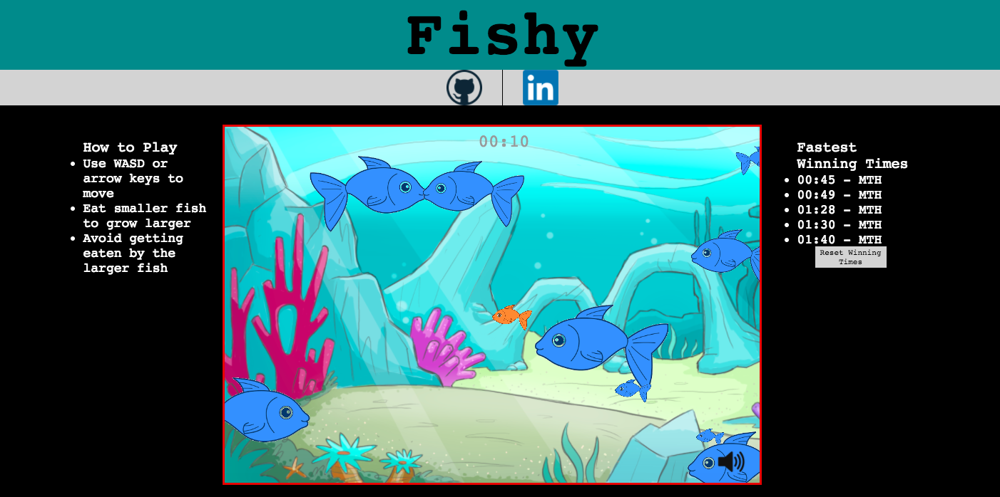

## Fishy Game

[Live Link](https://mthirabayashi.github.io/Fishy_Game/)

### Background

Fishy is a simple 1-player game.  The objective of the game is to eat all the smaller fish in the water and eventually grow to become the largest fish.  Eating a smaller fish will help grow your fish and running into a larger fish will end the game.

### Architecture and Technologies

This project was implemented using the following technologies:

- Vanilla JavaScript and `jQuery` for overall structure and game logic,
- `HTML5 Canvas` and `EaselJS`for DOM manipulation and rendering,
- `howler.js` for game sounds
- `js-cookie` to store user high scores locally in their browser
- Webpack to bundle and serve up the various scripts.

### Functionality & MVP  

Within the Fishy Game, users are able to:

- [x] Start the game
- [x] Move their fish around the game
- [x] View current score

#### Fish Movement
Fish are rendered using canvas and EaselJS.  Fish are randomly generated with various sizes, starting positions, and velocity. User controls allow for multiple inputs.

#### Sound
Game sounds are implemented using `howler.js`.  Background noise and collision sound effects can be toggled by the user by clicking on the speaker/mute icon.  Sound settings are saved locally using browser cookies so even upon reloading the page, previous sound settings will remain.

#### High Scores
User high scores are stored in the browser's cookies using `js-cookie`.  Clicking the 'reset fastest winning times' button clears the cookies and resets the user's personal high scores.

### Bonus features

There are some additional features that could be added in the near future:

- [x] Add high scores stored locally in browser cookies
- [ ] Add options for different game difficulties
- [ ] Add levels to the game to make it more user friendly
